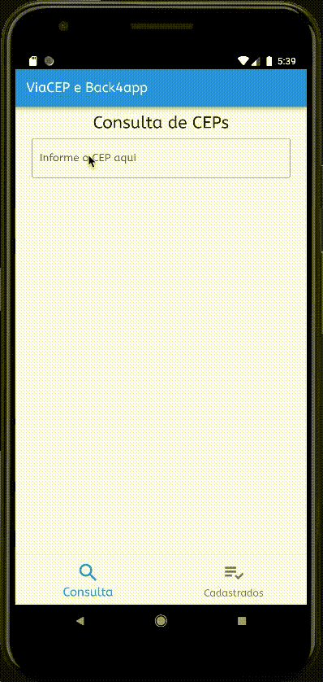

# APP Desenvolvido em Flutter

Esse app faz integração com as apis do ViaCep e do Back4app.

Quando o usuário informa um cep é consultado a api do ViaCep, caso o cep exista é cadastrado o cep na base de dado do app no servidor da Back4app.

No app é possível fazer a edição e exclusão de CEPS.

